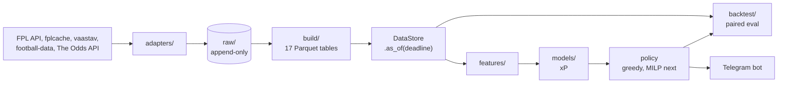

# fpl-optimizer

[](https://github.com/samintisar/fpl-optimizer/actions/workflows/ci.yml)

[](https://docs.astral.sh/uv/)
[](https://docs.astral.sh/ruff/)
[](LICENSE)

A Fantasy Premier League decision engine. It recommends transfers, captain, bench order and chip
timing to maximize **expected total points**, and will deliver them through a Telegram bot. It
recommends; you decide.

Most FPL tools give you a points projection and a solver. This project spends most of its effort on
the part they skip: **proving the recommendations are actually better**, using a backtest that can't
see the future and statistics that can't be fooled by one lucky season.

> **Status:** work in progress. Phases 0–4 of the nine phases (0–8) are done: a live data
> archiver, a 10-season point-in-time data warehouse, leakage tests, a backtester with paired
> statistical evaluation, and a MILP optimizer verified against open-fpl-solver. The real models
> come next. No live
> recommendations until a pre-registered holdout test passes ([roadmap](#roadmap)).

## Highlights

- **Point-in-time data, enforced.** Every derived row carries `event_time` and `available_at`.
  Features and the backtester read only through `DataStore(...).as_of(deadline)`, which keeps rows
  with `available_at < deadline`. A static architecture test stops feature code from reading files
  or keeping state any other way.
- **Corrupt-the-future leakage check.** Randomize or truncate every row after a deadline, recompute
  every feature, model and decision, and require byte-identical output. Runs in CI on synthetic
  data and on the real warehouse at known edge cases (season starts, COVID-era GW39–47, GW18 of
  2021/22 with 6 of 10 fixtures postponed).
- **Honest evaluation.** Season totals swing ±80–100 points on luck alone, so policies are compared
  only in **paired** runs from identical start states, per decision and over full seasons, with a
  **GW-block bootstrap** clustered by season. The test's size was measured by A/A placebo
  simulation. That found overlapping evaluation windows rejected ~17% of the time at a nominal 10%,
  so the windows were made non-overlapping.
- **A second, lower-variance metric.** "xG-scored points" swaps goals, assists and clean sheets for
  their xG-based expectations. A result counts only if its sign agrees with realized points.
- **Pre-registered go-live gate.** The 2025/26 season is held out and touched exactly once. The full
  system must beat both baselines in a one-sided paired test fixed in advance.
- **Reproducible from raw.** `raw/` is append-only, compressed and timestamped. Every Parquet table
  rebuilds from it with one command, and nothing is ever patched by hand.
- **Production ops on a home server.** systemd timers archive the FPL API and bookmaker odds daily
  and again in the 2 hours before each deadline (deadlines are read from the data, not hard-coded).
  A freshness check, a dead-man's-switch heartbeat and Telegram alerts catch silent failures.

## Results so far (Phase 3 baselines)

Backtests over 2016/17–2024/25, GW1 starts, averaged over a template squad and 5 random squads.
CIs are 80% two-sided (the lower bound is the one-sided α = 0.10 test). Full log:
[`results/experiments.csv`](results/experiments.csv).

| Comparison | Seasons | Full run, pts/GW (80% CI) | Per decision, pts per 4-GW window (80% CI) |
|---|---|---|---|
| Greedy transfers vs never transferring, rolling-average xP | 2016/17–2024/25 | **+11.4** (+10.4 to +12.6), ≈ +431/season | **+9.3** (+7.6 to +11.1) |
| Greedy on FPL's own `ep_next` vs greedy on rolling-average xP | 2021/22–2024/25 | −0.6 (−1.8 to +0.5) | −0.5 (−3.2 to +2.6) |

The xG-scored metric agrees in sign for both. FPL's official projection is no better than a
rolling average here, which sets a low but real bar the Phase 5 models must clear.

## How it works



1. **Ingest.** Thin, project-owned adapters for each source write gzipped, timestamped responses to
   `raw/`. One-off backfills pull 10 seasons of history (about 1 GB, mostly fplcache).
2. **Build.** `fplopt build all` turns `raw/` into 17 Parquet tables (players, fixtures, per-GW and
   per-match stats, snapshots, odds, Elo ratings) in about 90 seconds. Players are keyed on a stable
   `player_key` across seasons (FPL ids reset every year) and mapped to Understat by per-fixture
   minutes and fuzzy names, with validation that every player with minutes maps.
3. **Point in time.** `DataStore(data_dir).as_of(deadline)` is the only way features and the
   backtester see data. Each table kind (static, schedule, event, snapshot) has its own visibility
   rule, documented in [`docs/PLAN.md` §4](docs/PLAN.md#4-leakage-prevention).
4. **Backtest.** The simulator replays a season from any squad state (squad, purchase prices, bank,
   free transfers, chips) under FPL's rules: selling prices, autosubs, captaincy, FT banking, hits.
   Policies are pluggable.
5. **Next:** a MILP planner on HiGHS (multi-GW horizon, chip scenarios, top-3 plans), then
   market-implied team models (Dixon-Coles fitted to bookmaker odds), player shares with
   empirical-Bayes shrinkage, and a LightGBM minutes model.

The full design, including every data-source caveat and decision, is in
[`docs/PLAN.md`](docs/PLAN.md).

## Quickstart

Requires [uv](https://docs.astral.sh/uv/) and Python 3.12.

```bash
git clone https://github.com/samintisar/fpl-optimizer.git
cd fpl-optimizer
uv sync --all-extras
uv run pytest            # ~900 tests on synthetic data, no network needed
```

To run backtests on real data, backfill history into `raw/` (about 1 GB, 20–30 minutes in total),
build the tables, then run a comparison:

```bash
uv run fplopt backfill football-data
uv run fplopt backfill vaastav
uv run fplopt backfill fplcache
uv run fplopt build all
uv run fplopt backtest compare --a greedy:rolling --b roll:rolling --seasons 2021-2024
```

### CLI

| Command | What it does |
|---|---|
| `fplopt snapshot daily` / `tick` | Archive FPL, odds and football-data snapshots (the server's timers run these) |
| `fplopt backfill football-data\|vaastav\|fplcache\|element-summary` | One-off historical backfills into `raw/` |
| `fplopt build all` / `build <table>` | Rebuild `data/*.parquet` from `raw/` |
| `fplopt rules export <season>` | Write the season's scoring rules config from an archived bootstrap |
| `fplopt check freshness` | Fail and alert if the newest snapshot is missing or stale |
| `fplopt check leakage` | Corrupt-the-future check of every feature, model and decision probe on real data |
| `fplopt backtest run` | Replay one policy over seasons × start states; prints totals and captain/XI regret |
| `fplopt backtest compare` | Paired comparison of two policies with bootstrap CIs, realized and xG-scored |
| `fplopt optimize plan` | Top-3 plans plus the roll plan for a season, GW and start squad |
| `fplopt optimize bench` | Optimizer solve-time and pruning benchmark on real deadlines |

Policy specs look like `greedy:rolling:threshold=2.0`, `roll:ep_next` or `optimizer:ep_next:max_hits=0`. Every `run` and `compare`
appends a row (git sha, config, metrics, variant count) to `results/experiments.csv`. Run
`fplopt <group> --help` for all options.

### Environment variables

Only needed for the archiver and bot. Put them in a local `.env` (gitignored) or set them on the
server.

| Variable | Purpose |
|---|---|
| `TELEGRAM_BOT_TOKEN` | Bot token from @BotFather |
| `TELEGRAM_ADMIN_CHAT_ID` | Chat that receives pipeline-failure alerts |
| `ODDS_API_KEY` | The Odds API key (optional; odds are skipped without it) |
| `HEALTHCHECK_PING_URL` | Optional. Pinged after each successful `snapshot daily`/`tick`, for an external dead-man's switch such as healthchecks.io. Treated as a secret: never logged |
| `FPLOPT_RAW_DIR` | Raw snapshot root (default `raw`) |
| `FPLOPT_DATA_DIR` | Parquet root (default `data`) |
| `FPLOPT_USER_DB` | SQLite user-state path (default `data/users.sqlite`) |

Server setup (systemd user timers, alerts, heartbeat) is in [`deploy/README.md`](deploy/README.md).

## Roadmap

| # | Phase | Status |
|---|---|---|
| 0 | Snapshot archiver | ✅ Running on the server |
| 1 | Backfill + ID mapping + Parquet tables | ✅ 10 seasons, 17 tables, one-command rebuild |
| 2 | `as_of` layer + leakage tests | ✅ In CI and `fplopt check leakage` |
| 3 | Backtester + baselines + greedy policy | ✅ Paired full-run and per-decision evaluation with block bootstrap |
| 4 | MILP optimizer (transfers, captain, bench, chips, top-3 plans) | ✅ Matches open-fpl-solver; "beats greedy" deferred to Phase 5 (not shown out of sample with baseline xP) |
| 5 | Real models (market-implied team model, shares, minutes, calibration) | Next |
| 6 | Holdout evaluation on 2025/26 (single, pre-registered run) | |
| 7 | Telegram bot + go live | |
| 8 | Distributions, sensitivity analysis, uncertain fixtures | |

Progress is tracked as GitHub milestones (one per phase) and issues.

## Repository layout

```
src/fplopt/
  adapters/   one module per data source (fpl, odds, football_data, vaastav, fplcache)
  ingest/     raw snapshot writers (daily/tick jobs), one-off historical backfills
  build/      raw -> Parquet tables (`fplopt build all`), ID mapping, Elo, rules export
  features/   point-in-time feature builders (each takes one as-of view) + leakage check
  models/     xP models (rolling-average baseline today)
  backtest/   simulator, FPL rules and scoring, policies, start states, paired evaluation
  optimize/   MILP planner (Phase 4)
  bot/        Telegram bot (Phase 7)
config/       scoring rules per season, teams.csv (club names per source), overrides.csv
deploy/       systemd units + server runbook
docs/PLAN.md  design doc and decision log (source of truth)
results/      experiments.csv (tracked); run outputs (gitignored)
tests/        unit, architecture and leakage tests; `-m realdata` runs on the real warehouse
raw/, data/   (gitignored) immutable snapshots; Parquet tables and SQLite user state
```

## Ground rules

- `raw/` is append-only. Everything downstream rebuilds from it: fix the code and rebuild, never
  patch data.
- Every derived row carries `event_time` and `available_at`. Features and backtests read only
  through `as_of(deadline)`.
- FPL player ids reset every season. Key on `player_key`, never the FPL id.
- Tune on component metrics (log loss, calibration, MSE), not season totals.
- The 2025/26 holdout season stays untouched until Phase 6.
- Secrets live in `.env` or server env vars, never in the repo.

## Contributing

Issues and PRs are welcome. Before opening a PR:

```bash
uv run ruff check . && uv run ruff format --check .
uv run pytest
```

Read the relevant section of [`docs/PLAN.md`](docs/PLAN.md) before building a component. Changes
that touch features or models should keep `fplopt check leakage` passing.

## Data sources and acknowledgements

- [Fantasy Premier League](https://fantasy.premierleague.com/) public API: live snapshots.
- [Randdalf/fplcache](https://github.com/Randdalf/fplcache) (public domain): historical
  `bootstrap-static` snapshots from April 2021.
- [vaastav/Fantasy-Premier-League](https://github.com/vaastav/Fantasy-Premier-League): per-GW
  history from 2016/17, including its Understat mirror. This project never requests Understat
  directly.
- [football-data.co.uk](https://www.football-data.co.uk/): results and pre-match odds.
- [The Odds API](https://the-odds-api.com/): live odds.
- [open-fpl-solver](https://github.com/solioanalytics/open-fpl-solver) (Apache-2.0): the
  reference the Phase 4 optimizer is checked against (identical plans on 24 real instances).

Each source has its own terms. Raw snapshots and the Parquet tables built from them are not
redistributed in this repository. The only data file tracked is
[`results/experiments.csv`](results/experiments.csv), a log of this project's aggregate backtest
metrics (season totals, paired differences, CIs) that contains no source records.

## License

The code is released under the [MIT License](LICENSE), which also covers
`results/experiments.csv`. It does not cover the data the sources above provide.

This project is not affiliated with or endorsed by the Premier League or Fantasy Premier League.
